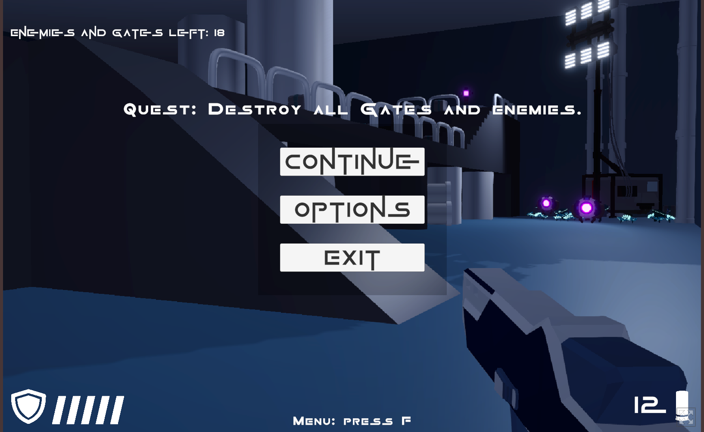

# 🔫 Sharp Shooter  
A fast-paced first-person action shooter built in Unity.  
The game features multiple weapons, enemy waves, destructible portals, loot drops and polished FPS mechanics such as ADS accuracy, recoil, sprinting and camera shake.

Playable WebGL version:  
👉 **https://sd7games.itch.io/sharp-shooter**

---

## 🎮 Features

### ✅ Completed & Implemented  
- **Modular Weapon System** (ScriptableObject-based):  
  - damage  
  - fire rate  
  - hip-fire spread  
  - ADS precision (no spread while aiming)  
  - magazine size  
  - reload time  
  - recoil pattern  
- **Recoil & Camera Shake** tuned per weapon.  
- **ADS System (Aim Down Sights)** for precise firing.  
- **Sprint System** with speed boost and audio feedback.  
- **Loot Boxes:**
  - ammo packs  
  - health packs  
- **Enemy & Portal System:**  
  - portals continuously spawn enemies  
  - portals and enemies have independent HP  
  - destroying all portals completes the mission  
  - full victory/defeat flow  

### 🤖 Enemy AI (NavMesh-based)  
- **NavMesh Agents** for pathfinding.  
- Enemies actively chase the player across the level.  
- AI automatically:  
  - goes around obstacles  
  - uses ramps and multi-level navigation  
  - recalculates path dynamically  
- Lightweight FSM: **idle → chase → attack**.  
- Optimized for WebGL.

### 🖥 UI & Visual Polish  
- Full HUD: ammo counter, health bar, hit feedback.  
- Settings menu (volume, mouse sensitivity).  
- Custom weapon animations (idle, fire, reload, ADS).  
- Custom audio (shots, reloads, footsteps, sprint).  
- **Post-processing:** bloom, vignette, color grading.  
- Clean architecture with low coupling and ScriptableObjects.

---

## 🧠 Tech & Architecture  
- Unity  
- C#  
- ScriptableObjects for weapon data  
- NavMesh & NavMesh Agents  
- Animator state machines  
- Event-driven UI  
- Post-processing effects  
- Camera-based recoil & shake  
- Simple enemy FSM

---

## 📂 Project Structure
```
/Assets
    /Animations
    /Audio
    /Prefabs
    /Scripts
        /Weapons
        /Player
        /Enemies
        /UI
        /Systems
    /SO (WeaponData)
    /Materials
    /Scenes
```

---

## 🎮 How to Play  
1. Play the browser version:  
   👉 https://sd7games.itch.io/sharp-shooter  
2. Destroy all portals to stop enemy waves.  
3. Collect ammo and health from loot boxes.  
4. Use ADS for accurate firing.  
5. Sprint to reposition quickly.  

---

## 📸 Screenshots

### 🔭 Sniper Aiming (ADS)
<p align="center">  </p>

### 💥 Shooting, VFX & Combat
<p align="center">  </p>

### 🎮 Pause Menu
<p align="center">  </p>

### 👾 Enemies & Navigation Movement
<p align="center">  </p>

### ☠️ Game Over Screen
<p align="center">  </p>

### ⚙️ Options Menu
<p align="center">  </p>

---

## 👨‍💻 Developer  
**Oleksandr Tokarev** — Unity & C# Game Developer based in Finland.  
Focused on gameplay programming and FPS mechanics.  
Open to work and collaboration.
